# Průvodní listina

Na našem analytickém oddělení nezávislé společnosti, která se zabývá životní úrovní občanů, jsme se rozhodli odpovědět na několik klíčových výzkumných otázek týkajících se dostupnosti základních potravin pro širokou veřejnost.

Naši kolegové již definovali základní otázky, na které se pokusíme odpovědět, a výsledky poskytneme tiskovému oddělení. Toto oddělení bude prezentovat naše zjištění na nadcházející konferenci zaměřené na tuto problematiku.

## Výzkumné otázky

1.  Rostou v průběhu let mzdy ve všech odvětvích, nebo v některých klesají?
2.  Kolik je možné si koupit litrů mléka a kilogramů chleba za první a poslední srovnatelné období v dostupných datech cen a mezd?
3.  Která kategorie potravin zdražuje nejpomaleji (je u ní nejnižší percentuální meziroční nárůst)?
4.  Existuje rok, ve kterém byl meziroční nárůst cen potravin výrazně vyšší než růst mezd (větší než 10 %)?
5.  Má výška HDP vliv na změny ve mzdách a cenách potravin? Pokud HDP vzroste výrazněji v jednom roce, projeví se to na cenách potravin či mzdách ve stejném nebo následujícím roce výraznějším růstem?

Aby bylo možno na tyto otázky odpovědět, tento projekt připraví robustní datové podklady, které umožní porovnání dostupnosti potravin na základě průměrných příjmů za určité časové období. Jako dodatečný materiál bude připravena tabulka s HDP, GINI koeficientem a populací dalších evropských států ve stejném období, jako primární přehled pro Českou republiku.

Výstupem budou dvě tabulky v databázi, ze kterých se požadovaná data dají získat:

-   [t_katerina_janku_project_SQL_primary_final](https://github.com/Kaata23/Engeto/blob/main/sql_primary_final.sql) (pro data mezd a cen potravin za Českou republiku sjednocených na totožné porovnatelné období) a
-   [t_katerina_janku_project_SQL_secondary_final](https://github.com/Kaata23/Engeto/blob/main/sql_secondary_final.sql) (pro dodatečná data o dalších evropských státech).

Dále bude připravena sadu SQL dotazů, které nám pomohou zodpovědět na vytyčené výzkumné otázky.

# Vypracování projektu - tvorba datových podkladů

## Datové sady, které je možné požít pro získání vhodného datového podkladu

Nejprve je třeba seznámit se s daty, která máme k dispozici a prostudovat jejich strukturu a vztahy:

### Primární tabulky

#### *czechia_payroll*

Informace o mzdách v různých odvětvích za několikaleté období. Datová sada pochází z Portálu otevřených dat ČR a obsahuje časovou řadu počtu zaměstnanců a průměrných měsíčních mezd (fyzické i přepočtené osoby, tj. zohledňující délku pracovního úvazku.) podle odvětví od roku 2000 do roku 2021. Data jsou uvedena po čtvrtletích pričemž poslední rok obsahuje jen poslední dvě čtvrtletí.

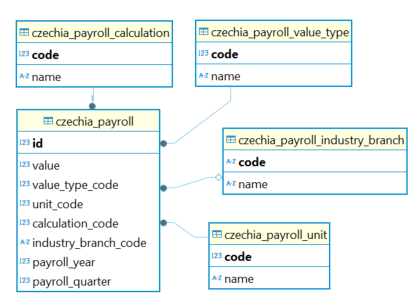

##### czechia_payroll_industry_branch

Číselník odvětví v tabulce mezd. Pokud tento údaj není uveden, jedná se o úhrn za všechna odvětví.

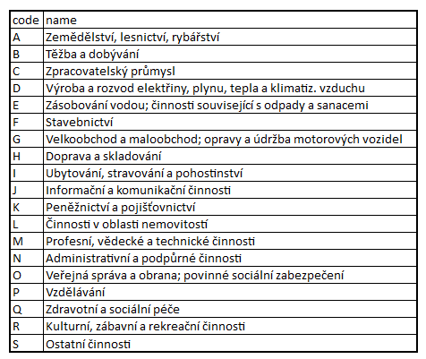

##### *czechia_payroll_calculation*

Číselník kalkulací v tabulce mezd. Položka 100 znamená fyzický počet zaměstnanců, položka 200 přepočtený počet zaměstnanců na plný úvazek. V tomto projektu se budeme soustředit na přepočtený počet zaměstnanců.

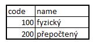

##### czechia_payroll_value_type

Číselník typů hodnot v tabulce mezd. V této datové sadě jsou pouze kódy 316 (počet zaměstnanců) nebo 5958 (průměrná mzda), my se budeme soustředit pouze na průměrnou hrubou mzdu na zaměstnance.

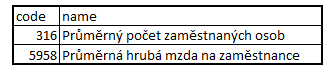

##### czechia_payroll_unit

Číselník jednotek hodnot v tabulce mezd. Jak můžeme vidět z následujícího SQL dotazu, tyto údaje se v databázi nějak pomíchali, ve skutečnosti položka 200 znamená Kč a 80403 jsou tisíce osob. Pro potřeby tohoto projektu tento údaj vynecháme, jelikož budeme pracovat jen s value_type 5958 budeme brát, že tyto údaje jsou vždy v Kč.

```
SELECT 
	cpvt.*,
	cpu.*
FROM czechia_payroll cp 
LEFT JOIN czechia_payroll_value_type cpvt 
	ON cp.value_type_code  = cpvt.code 
LEFT JOIN czechia_payroll_unit cpu 
	ON cp.unit_code = cpu.code 
GROUP BY 
	cpvt.code, 
	cpvt.name,
	cpu.code,
	cpu.name;
```

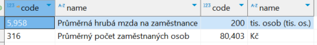

#### czechia_price

Datová sada pochází z Portálu otevřených dat ČR a obsahuje časovou řadu statistických údajů o průměrných spotřebitelských cenách vybraného potravinářského zboží za Českou republiku a kraje zjišťované od počátku roku 2006 do konce roku 2018.

Ceny potravinářského zboží jsou měřeny v rúzných intervalech v rúzných časových obdobích, např zpočátku jsou měření týdně a od roku 2010 už jen jednou měsíčně, přičmž tyto intervaly jsou vždy v určitém období stejné pro jednotlivé kategorie, s vyjímkou kapra, který je sledován každoročne jen v prosinci. Jelikož budeme pracovat s průměrnými ročními cenami, tak nám to nevadí, vyloučíme ale položku Jakostní víno bílé, která se sleduje az od roku 2015, aby nám nezkreslila celkový průměr sledovaných cen.

Kromě kategorií nám tabulka czechia_price poskytuje také kód region region_code, který by se dal napojit na číselník czechia_region, a mohli bychom tak sledovat ceny z pohledu krajů, toto možnost však nevyužijeme, jelikož podobné rozdělení nemáme u mezd.

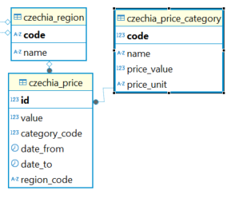

##### czechia_price_category

Číselník kategorií potravin, které se vyskytují v tabulce czechia_price.

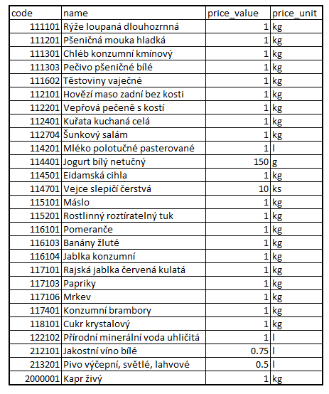

### Číselníky sdílených informací o ČR:

#### czechia_region

Číselník krajů České republiky dle normy CZ-NUTS

#### czechia_district

Číselník okresů České republiky dle normy LAU.

### Dodatečné tabulky:

#### countries

Všemožné informace o zemích na světě, například hlavní město, měna, národní jídlo nebo průměrná výška populace

#### economies

HDP, GINI, daňová zátěž, atd. pro daný stát a rok.

## Příprava tabulek

### Příprava primární tabulky

Při tvorbě primární tabulky jsem si nejprve vyselektovala relevantní data z tabulek czechia_payroll a czechia_price a připojila k nim jejich číselníky a zagregovala je po rocích, po kterých budeme tabulky spojovat. 

Finální SQL soubor naleznete [ZDE](https://github.com/Kaata23/Engeto/blob/main/sql_primary_final.sql).

#### czechia_price

Z tabulky czechia_price potřebujeme zjistit jak se měnili průměrné ceny kategorií v letech, údaje o regionu nepotřebujeme, vyfiltrujeme tedy kde je region_code prazdný, což představuje úhrn pro celou republiku. Dále z výběru vyloučíme Jakostní víno bílé, které se narozdíl ostatních sleduje az od roku 2015, a mohlo by nám tak zkreslit celkový průměr všech sledovaných kategorií.

```
SELECT
	date_part('year',cp.date_from) AS price_year,
	cp.category_code AS price_category_id,
	cpc.name AS price_category_name,
	cpc.price_value,
	cpc.price_unit,
	round(avg(cp.value)::numeric,2) AS avg_price
FROM czechia_price cp
LEFT JOIN czechia_price_category cpc
	ON cpc.code=cp.category_code
WHERE 
	cp.region_code IS NULL
	AND cp.category_code != '212101'
GROUP BY
	price_year,
	price_category_id,
	price_category_name,
	cpc.price_value,
	cpc.price_unit
ORDER BY
	price_year,
	price_category_id;
```

#### czechia_payroll

Z tabulky czechia_payroll potřebujeme zjistit jak se měnili průměrné platy v jednotlivých odvětvích v letech, vyfiltrujeme value_type_code 5958, tj. průměrnou hrubou mzdu na zaměstnance a calculation_code 200, tj. přepočtený počet zaměstnanců na plný úvazek.

```
SELECT
	cpay.payroll_year,
	cpay.industry_branch_code AS payroll_industry_id,
	cpib."name" AS payroll_industry_name,
	round(avg(cpay.value)::numeric,2) AS avg_payroll
FROM czechia_payroll cpay
LEFT JOIN czechia_payroll_industry_branch cpib
	ON cpib.code = cpay.industry_branch_code
WHERE
	cpay.value_type_code = '5958'
	AND cpay.calculation_code = '200'
GROUP BY
	cpay.payroll_year,
	payroll_industry_id,
	payroll_industry_name
	ORDER BY
	cpay.payroll_year,
	payroll_industry_id;
```

#### final primary table

Finální tabulku jsem připravila spojením těchto dvou tabulek na sloupci rok, což zajistí že v tabulce budou jen data za roky, pro které máme údaje jak pro mzdy tak pro ceny.

```
CREATE TABLE IF NOT EXISTS t_katerina_janku_project_SQL_primary_final AS
	SELECT 
		pr.*,
		pa.payroll_industry_id,
		pa.payroll_industry_name,
		pa.avg_payroll 
	FROM 
		(SELECT 
			date_part('year',cp.date_from) AS price_year,
			cp.category_code AS price_category_id,
			cpc.name AS price_category_name,
			cpc.price_value,
			cpc.price_unit,
			round(avg(cp.value)::numeric,2) AS avg_price
		FROM czechia_price cp
		LEFT JOIN czechia_price_category cpc
			ON cpc.code=cp.category_code
		WHERE 
			cp.region_code IS NULL
			AND cp.category_code != '212101'
		GROUP BY 
			price_year,
			price_category_id,
			price_category_name,
			cpc.price_value,
			cpc.price_unit) pr
	JOIN 
		(SELECT 
			cpay.payroll_year,
			cpay.industry_branch_code AS payroll_industry_id,
			cpib."name" AS payroll_industry_name,
			round(avg(cpay.value)::numeric,2) AS avg_payroll
		FROM czechia_payroll cpay
		LEFT JOIN czechia_payroll_industry_branch cpib 
			ON cpib.code = cpay.industry_branch_code
		WHERE 
			cpay.value_type_code = '5958'
			AND cpay.calculation_code = '200'
		GROUP BY 
			cpay.payroll_year,
			payroll_industry_id,
			payroll_industry_name ) pa
	ON pa.payroll_year = pr.price_year
	ORDER BY 
		pr.price_year,
		pr.price_category_id, 
		pa.payroll_industry_id;	
```

### Příprava sekundární tabulky

Sekundární tabulka bude obsahovat data s HDP, GINI koeficientem a populací dalších evropských států za stejné období, jako primární přehled pro Českou republiku. Všechny pro nás důležité informace jsou v tabulce economies, tabulka countries však obsahuje informace, které státy patří do Evropy, spojíme tedy tabulky dohromady na sloupci country a vyfiltrujeme si pouze evropské státy a roky, které jsou v primárví tabulce. 

Finální SQL soubor naleznete [ZDE](https://github.com/Kaata23/Engeto/blob/main/sql_secondary_final.sql).

```
CREATE TABLE IF NOT EXISTS t_katerina_janku_project_SQL_secondary_final AS
	SELECT 
		e.country,
		e."year",
		e.gdp,
		e.population,
		e.gini,
		e.taxes
	FROM economies e 
	JOIN countries c
		ON e.country = c.country
	WHERE 
		c.continent = 'Europe'
		AND e."year" BETWEEN 
			(SELECT min(price_year) FROM t_katerina_janku_project_SQL_primary_final)
			AND 
			(SELECT max(price_year) FROM t_katerina_janku_project_SQL_primary_final); 
```

# Výzkumné otázky

V poslední části se pokusíme odpovědět na naše výzkumné otázky.

## 1. Rostou v průběhu let mzdy ve všech odvětvích, nebo v některých klesají?

Odpověď na tuto otázku nalezneme v tomto [SQL souboru](https://github.com/Kaata23/Engeto/blob/main/SQL_otazka_1.sql).

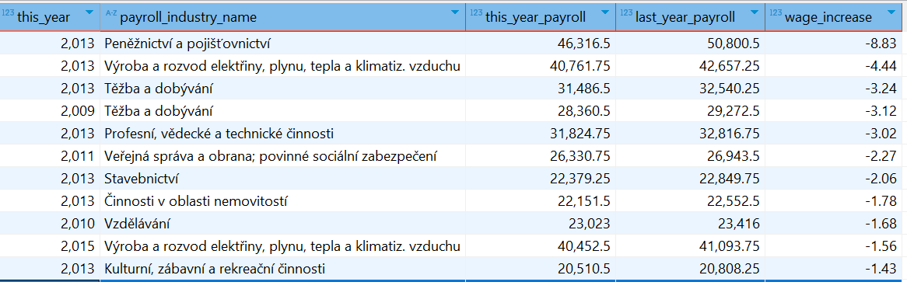

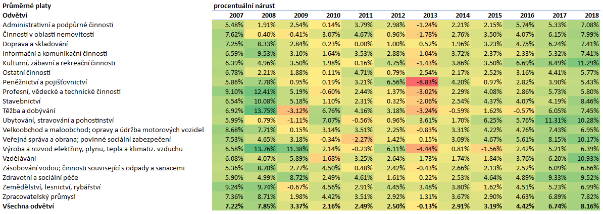

Z výsledků vidíme, že přestože mzdy v průběhu let většinou rostly, existují odvětví, ve kterých v některých letech klesaly. Největší pokles průměrných mezd byl v sektoru *Peněžnictví a pojišťovnictví* v roce 2013, kdy mzdy klesly o 8.83 % oproti roku 2012. V tom samém roce klesaly průměrké mzdy take ve většině jiných odvětvíc (11 odvětví), zatímco ostatní odvětví zaznamemaly jen mírný růst. K odvětvím, kde průměrné mzdy klesaly nejčastěji za sledované období patří *Těžba a dobývání* (4x) a *Výroba a rozvod elektřiny, plynu, tepla a klimatiz. Vzduchu* (3x). Celkově existují jen tři odvětví, které ve sledovaném období nezaznamenaly pokles ani v jednom roce a to jsou sektory *Zpracovatelský průmysl*, *Zdravotní a sociální péče* a *Ostatní činnosti*.

## 2. Kolik je možné si koupit litrů mléka a kilogramů chleba za první a poslední srovnatelné období v dostupných datech cen a mezd?

Odpověď na tuto otázku nalezneme v tomto [SQL souboru](https://github.com/Kaata23/Engeto/blob/main/SQL_otazka_2.sql).

V roce 2006 (první srovnatelné období) byla průměrná mzda 19,536 Kč, chléb stál průměrně 16,12 Kč a mléko 14,44 Kč. Za průměrnou mzdu bylo tedy možné si koupit 1212 kilogramů chleba a 1353 litrů mléka. Naproti tomu v roce 2018 (poslední srovnatelné období) byla průměrná mzda 32,043 Kč, chléb stál průměrně 24,24 Kč a mléko 19,82 Kč. Za průměrnou mzdu bylo tedy možné si koupit 1322 kilogramů chleba a 1617 litrů mléka.

V roce 2018 bylo tedy možné za průměrnou mzdu koupit o 110 kilogramů chleba a o 264 litrů mléka více než v roce 2006.

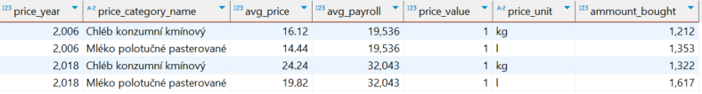

## 3. Která kategorie potravin zdražuje nejpomaleji (je u ní nejnižší percentuální meziroční nárůst)?

Odpověď na tuto otázku nalezneme v tomto [SQL souboru](https://github.com/Kaata23/Engeto/blob/main/SQL_otazka_3.sql).

Nejpomaleji zdražují *Cukr krystalový* a *Rajčata*, která v průměru za celé sledované období spíše zlevňují (-1.92% a -0.72%).

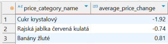

Rajčata jsou zárověň produktem, u kterého je nejvyšší meziroční pokles, v roce 2007 jejich cena klesla o 30.28% a pak znovu v roce 2011 o 28.19% a v tabulce 10 potravin s největším meziročním poklesem se tak umístili dvakrát.

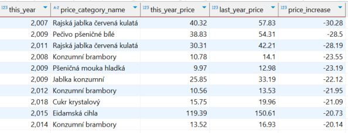

## 4. Existuje rok, ve kterém byl meziroční nárůst cen potravin výrazně vyšší než růst mezd (větší než 10 %)?

Odpověď na tuto otázku nalezneme v tomto [SQL souboru](https://github.com/Kaata23/Engeto/blob/main/SQL_otazka_4.sql)

Takový rok neexistuje, ceny potravin rostly většinou pomaleji než mzdy a někdy i klesaly. Největší meziroční nárust mezd byl v roce 2017 (10.12%), v tomto roce však mzdy také vzrostly (o 6.74%) a tak výsledný rozdíl nebyl tak velký (pouze 3.38%). Nejvíce rostly ceny v porovnání se mzdami v roce 2013 (o 5.23% více), což je způsobeno tím, že v tomto roce průměrná mzda stagnovala nebo mírně klesala. Naopak největší rozdíl mezi růstem cen a mezd byl v roce 2009, kdy byl růst mezd o 9.78% větší, jelikož ceny v tomto období klesaly (-6.41%).

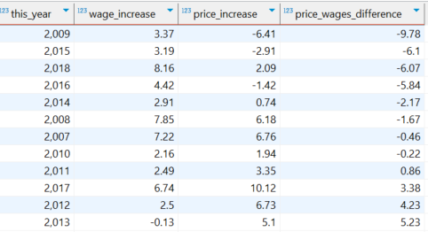

## 5. Má výška HDP vliv na změny ve mzdách a cenách potravin? Neboli, pokud HDP vzroste výrazněji v jednom roce, projeví se to na cenách potravin či mzdách ve stejném nebo následujícím roce výraznějším růstem?

Odpověď na tuto otázku nalezneme v tomto [SQL souboru](https://github.com/Kaata23/Engeto/blob/main/SQL_otazka_5.sql)

V následující tabulce můžeme vidět porovnání růstu mezd, cen a HDP ve sledovaných letech.

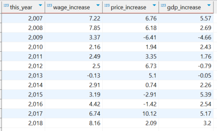

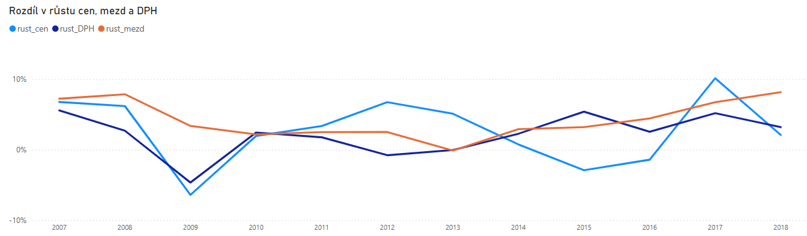

Z těchto dat jsme si vypočítali korelační koeficienty:

-   Korelace mezi růstem HDP a změnami cen potravin je 0.413
-   Korelace mezi růstem HDP a změnami mezd je 0.487
-   Korelace mezi růstem HDP zpozdeným o rok a změnami cen potravin je -0.038
-   Korelace mezi růstem HDP zpozdeným o rok a změnami mezd je 0.701

Z těchto výsledků vyplývá, že existuje pozitivní korelace mezi růstem HDP a změnami cen potravin a mezd, neboli, že když HDP roste, mají tendenci růst i ceny potravin a mzdy. Nicméně, tato korelace není extrémně silná, což naznačuje, že existují i další faktory ovlivňující ceny potravin a mzdy.

Mezi HDP a mzdami existuje silnější vztah, pokud se HDP posune o rok zpět. Tento koeficient je poměrně vysoký a pozitivní, což naznačuje silnou pozitivní lineární závislost mezi zpožděným HDP a mzdami. To znamená, že růst HDP v jednom roce má tendenci být spojen s růstem mezd v následujícím roce.

U cen potravin však HDP z předchozího roku nemá téměř žádný vliv na ceny potravin v následujícím roce.

To potvrzuje, že mzdy reagují na ekonomiku se zpožděním, zatímco ceny potravin jsou spíše ovlivněny jinými faktory.
